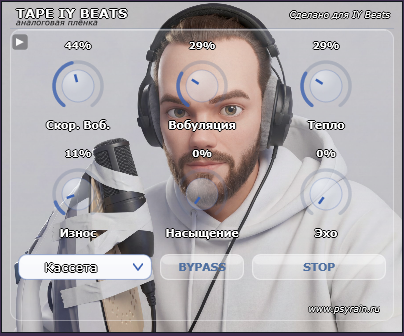

# Tape IY Beats

**Креативный ленточный мульти-эффект** для Windows (VST3 / Standalone): музыкальный
wow/flutter, ленточное насыщение, эхо с синхронизацией к темпу, режимы машин и
артефакты износа — тёплый аналоговый и лоу-фай звук.

Автор: **Psychedelic Rain** · Версия **1.0.0** · **Бесплатно** (freeware)
Сделано для **[IY Beats](https://www.youtube.com/@IYBeats)**.

> *A creative analog-tape multi-effect: musical wow/flutter, tape saturation,
> tempo-synced echo, machine modes and tape-wear artifacts. Windows, VST3 / Standalone. Freeware.*

---

## 🎬 Демонстрация

▶ **[Смотреть видео-демонстрацию (со звуком)](assets/IY_GitHub_Video.mp4)**

---

## ✨ Возможности

**Ручки**
- **Скор. Воб.** — скорость колебаний высоты тона (wow/flutter)
- **Вобуляция** — глубина колебаний (сколько «плавания» ленты)
- **Тепло** — тёплый тон: срез верха + «тело» (head bump)
- **Износ** — деграда: выпадения, реверс-глитчи, шум, print-through
- **Насыщение** — ленточное насыщение (мягкая компрессия и гармоники)
- **Эхо** — ленточное эхо, синхронизированное к темпу хоста

**Режимы машин** — Кассета · Катушка · VHS · Диктофон (перенастраивают весь характер).

**Прочее** — Tape Stop (плавный тормоз ленты), Bypass, анимированный видео-фон
с кнопкой стоп/пуск, подсказки при наведении.

---

## ⬇️ Скачать

Последняя версия — на вкладке **[Releases](../../releases)**:
скачайте `Tape IY Beats v1.0.0 Setup.exe` и запустите от имени администратора.

## 🛠 Установка

Установщик сам кладёт VST3 в `C:\Program Files\Common Files\VST3` (можно выбрать
другую папку) и ставит Standalone-версию. После установки **пересканируйте плагины**
в DAW и перезапустите её.

*Вручную:* скопируйте папку `Tape IY Beats.vst3` в `C:\Program Files\Common Files\VST3`.

## 💻 Требования

Windows 10 / 11, 64-bit. Хост с поддержкой VST3 (FL Studio и др.).
Standalone-версия работает без DAW.

## ❓ FAQ

Частые вопросы — см. **[FAQ.md](FAQ.md)**.

---

## 🙏 Благодарность

Этот плагин — знак признательности **IY Beats**.

За огромный вклад в развитие музыкантов — и тех, кто только нащупывает свой
первый бит, и опытных продюсеров, которым он раз за разом открывает новое.
За то, что помогает людям услышать и раскрыть себя. И за редкое, упрямое
качество, которое он держит уже столько лет, что счёт давно потерян.

Спасибо за всё это. Эта работа — маленький ответ на большую отдачу.

---

## 📄 Лицензия и авторские права

Бесплатно (freeware) — см. **[LICENSE.txt](LICENSE.txt)**.
Создано с помощью JUCE. VST — товарный знак Steinberg Media Technologies GmbH.
Сторонние компоненты — см. **[THIRD_PARTY_NOTICES.txt](THIRD_PARTY_NOTICES.txt)**.

© 2026 Psychedelic Rain. Сделано для IY Beats.
Сайт: https://www.psyrain.ru · Контакт: psychedelic.rain@gmail.com
